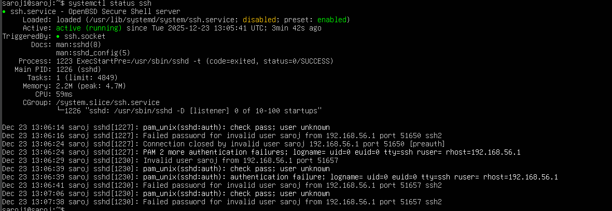
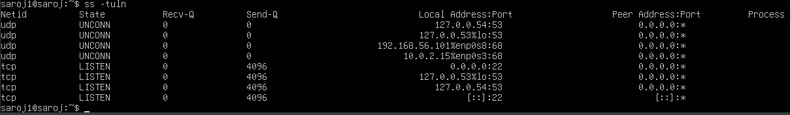
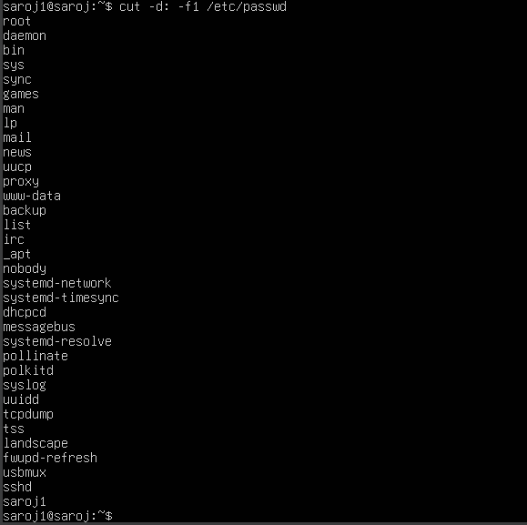

# 1. Introduction

The objective of Week 2(Security Planning and Testing Methodology) is to design a comprehensive security baseline and a structured performance testing methodology prior to system configuration. Establishing security and testing plans at this stage ensures that all subsequent technical implementations are deliberate, measurable, and aligned with best practices in Linux server administration.

This phase emphasises proactive security design, threat awareness, and systematic performance evaluation rather than reactive configuration.

# 2. Performance Testing Methodology

A structured performance testing methodology was designed to evaluate how the operating system behaves under different workload conditions. Performance data will be collected remotely from the Fedora Workstation using Secure Shell (SSH), ensuring minimal interference with server-side processes.

## 2.1 Remote Monitoring Approach

Performance metrics will be gathered using standard Linux command-line utilities executed remotely via SSH. This approach reflects professional system administration practices, where servers are monitored externally to preserve system integrity and reduce measurement bias.

The following metrics will be monitored:

CPU utilisation

Memory usage

Disk input/output activity

Network throughput and latency

System load averages

## 2.2 Testing Phases

Performance evaluation will be conducted in the following phases:

#### Baseline Testing

Baseline measurements will be recorded when the system is idle, providing a reference point for comparison against active workloads.

####Load Testing

Selected applications will be executed to generate CPU, memory, disk, and network stress. Performance metrics will be recorded during peak workload execution.

Bottleneck Identification

Collected data will be analysed to identify resource constraints such as CPU saturation, memory exhaustion, or disk I/O limitations.

#### Optimisation Testing

System optimisations will be applied and re-tested to quantify performance improvements using comparative metrics.

# 3. Security Configuration Checklist

A comprehensive security configuration checklist was developed to define the minimum acceptable security posture for the Ubuntu Server system. Each control will be implemented and verified in later phases.

## 3.1 SSH Hardening

Disable password-based authentication

Enforce SSH key-based authentication

Restrict SSH access to a single authorised workstation

Disable root login over SSH

## 3.2 Firewall Configuration

Enable host-based firewall

Permit SSH traffic only from the workstation IP address

Deny all other inbound connections by default

## 3.3 Mandatory Access Control

Implement AppArmor or SELinux

Enforce application confinement policies

Monitor and log access control violations

## 3.4 Automatic Security Updates

Enable unattended security updates

Ensure critical patches are applied automatically

## 3.5 User Privilege Management

Create a non-root administrative user

Apply least-privilege principles

Restrict use of superuser permissions

## 3.6 Network Security

Minimise exposed network services

Verify listening ports

Ensure unused services are disabled

# 4. Threat Model

A threat model was developed to identify realistic security risks and define mitigation strategies appropriate for a Linux server environment.

### Threat 1: Brute-Force SSH Attacks

Description:
Attackers may attempt repeated login attempts to gain unauthorised access via SSH.

Impact:
Compromise of server confidentiality and administrative control.

Mitigation Strategy:

Disable password authentication

Enforce SSH key-based authentication

Implement intrusion detection mechanisms

### Threat 2: Unauthorised Network Access

Description:
Open network ports may allow unauthorised users to access server services.

Impact:
Increased attack surface and potential service exploitation.

Mitigation Strategy:

Strict firewall rules

Port minimisation

Regular network scanning and verification

### Threat 3: Privilege Escalation

Description:
Misconfigured user privileges may allow standard users to gain administrative access.

Impact:
Full system compromise and loss of integrity.

Mitigation Strategy:

Least-privilege user configuration

Controlled use of administrative privileges

Continuous monitoring of privilege usage

# 5. Reflection

In this we established a robust foundation for secure system deployment by defining clear security controls and a repeatable performance testing methodology. By identifying threats and mitigation strategies before implementation, the system design prioritises security, accountability, and measurable performance outcomes.

This structured planning phase ensures that subsequent configuration and testing activities are both purposeful and defensible, reflecting professional Linux server administration standards.