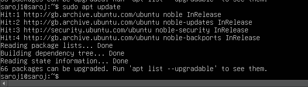
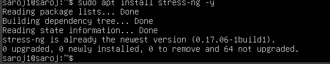
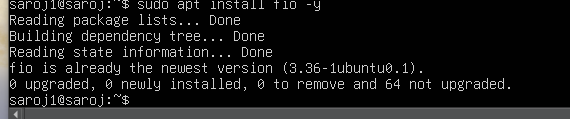
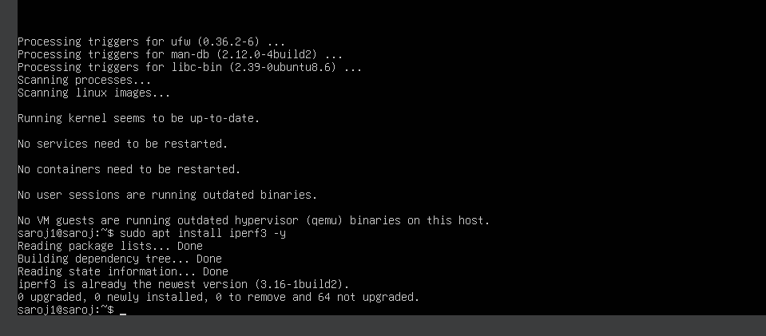
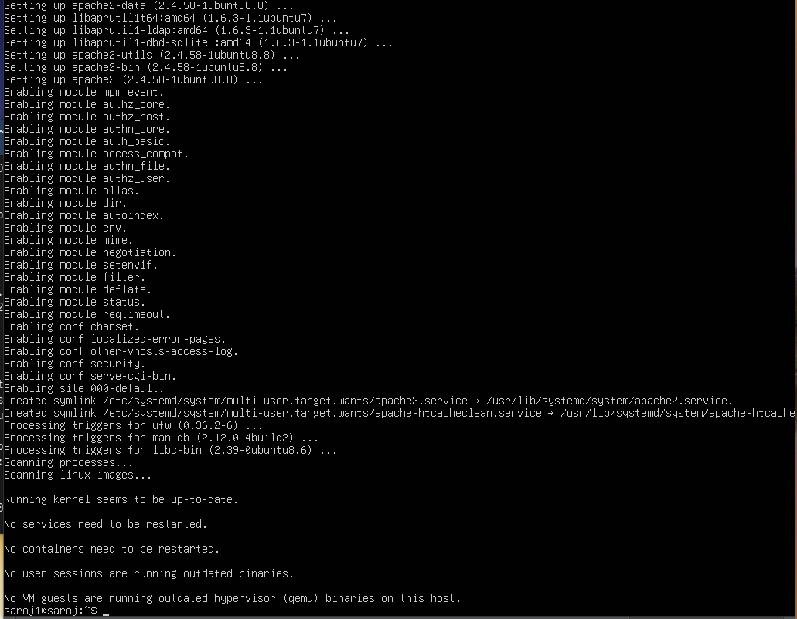
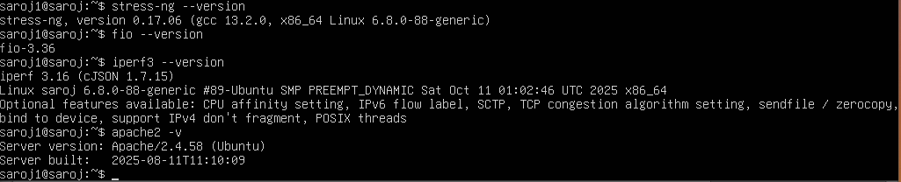

# 1.Introduction

The following commands were executed on the Ubuntu Server system to install and verify applications selected for performance testing. Each application represents a different workload type, enabling structured analysis of operating system behaviour in later phases.
_________________________________________________________________________________
# 2. Package Index Update
sudo apt update

Explanation:
This command updates the local APT package index, ensuring that the latest package metadata is available prior to software installation.

_________________________________________________________________________________

# 3. CPU and Memory Stress Tool Installation
sudo apt install stress-ng -y

Explanation:
Installs stress-ng, a comprehensive workload generator used to create controlled CPU and memory stress scenarios for performance evaluation.

_________________________________________________________________________________
# 4. Disk I/O Performance Tool Installation
sudo apt install fio -y

Explanation:
Installs fio, a flexible and widely adopted disk benchmarking tool used to simulate sequential and random read/write workloads.

_________________________________________________________________________________
# 5. Network Performance Testing Tool Installation
sudo apt install iperf3 -y

Explanation:
Installs iperf3, a network performance measurement tool used to evaluate throughput and latency between systems.

_________________________________________________________________________________
# 6. Server Application Installation (Web Server)
sudo apt install apache2 -y

Explanation:
Installs the Apache HTTP Server, representing a persistent server workload that generates continuous CPU, memory, and network activity.

_________________________________________________________________________________
# 7. Verification of Installed Applications
stress-ng --version

fio --version

iperf3 --version

apache2 -v

Explanation:
These commands confirm that each selected application is correctly installed and accessible, ensuring readiness for performance testing in subsequent phases.

_________________________________________________________________________________
# 8. Service Status Verification (Apache)
systemctl status apache2

Explanation:
Verifies that the Apache service is running and managed correctly by the system service manager.

_________________________________________________________________________________
# 8.Reflection

The successful installation and verification of these applications establishes a controlled and representative testing environment. Each tool targets a specific system resource, enabling precise measurement of operating system performance characteristics during later benchmarking and optimisation activities.