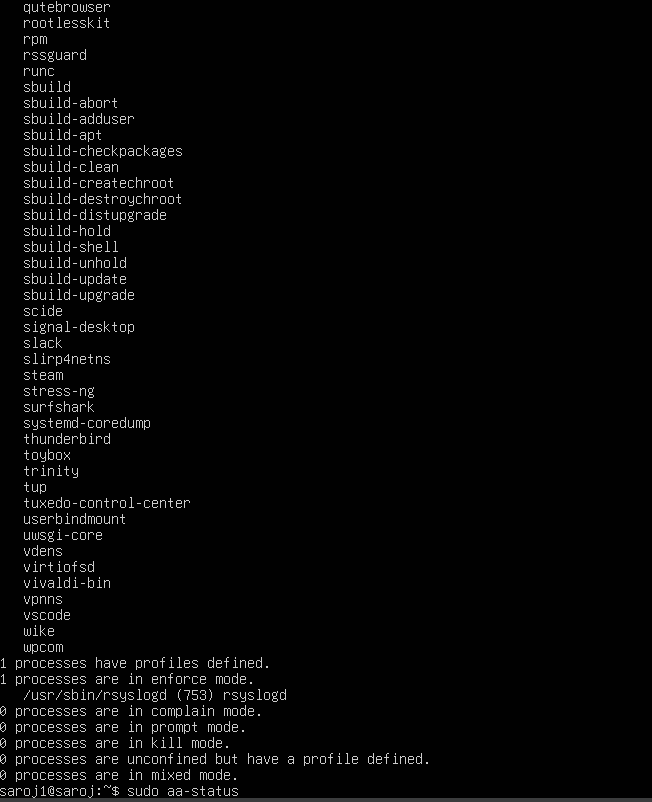
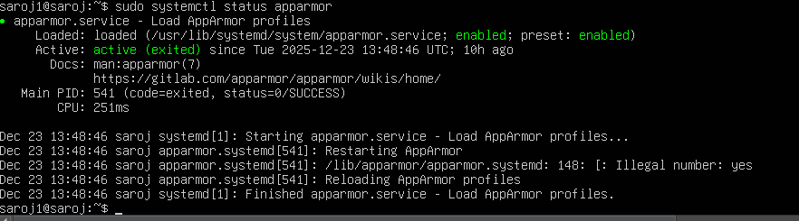
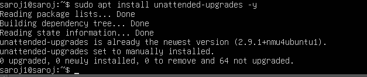
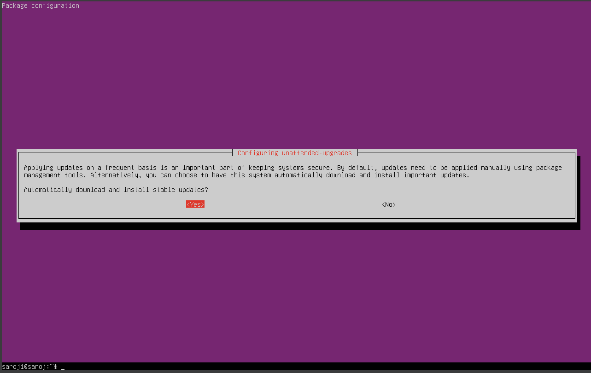
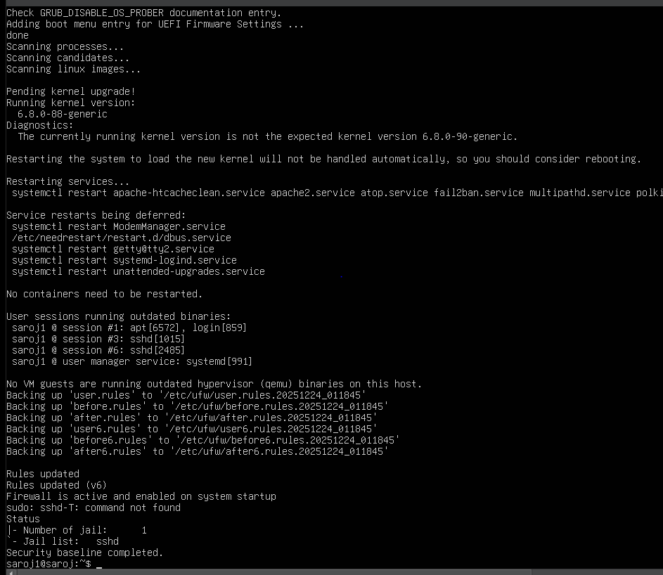
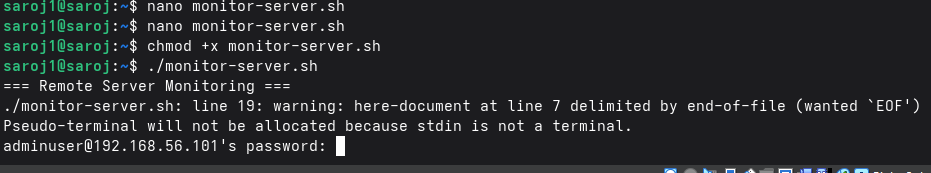

# 1. Introduction
The objective of Week 5 is to improve the security of the Ubuntu Server by implementing advanced security control and installing  a remote monitoring capability. This part  builds upon the foundational security measure applied in Week 4 and introduce automated verification and continuous observation mechanism.
The focus area include mandatory access control(MAC), automatic security updates, intrusion prevention, and the development of custom security and monitoring script, reflecting professional system administration practice.
_________________________________________________________________________________
# 2. Mandatory Access Control (App Armor)
## 2.1 Apparmor Status Verification
sudo aa-status
Explanation:
This command display the current status of AppArmor, including loaded and enforce profile. Apparmor restrict application capabilitie based on predefined policies, limiting the impact of compromised process.

_________________________________________________________________________________
## 2.2 Ensuring Apparmor Is Enabled
sudo systemctl status apparmor
Explanation:
It confirm that the Apparmor service is active and enforcing access control policie.

_________________________________________________________________________________
# 3. Automatic Security Updates Configuration
## 3.1 Installing Unattended Upgrade
sudo apt install unattended-upgrades -y
Explanation:
It install the unattended upgrade package, enabling automatic installation of critical security updates.

_________________________________________________________________________________
## 3.2 Enabling Automatic Update
sudo dpkg-reconfigure --priority=low unattended-upgrades
Explanation:
It configure the system to automatically apply security update without manual intervention.

_________________________________________________________________________________
## 3.3 Verifying Automatic Updates Service
systemctl status unattended-upgrades
Explanation:
It verifiy that the automatic updates service is active and running in a proper and correctly ways.

_________________________________________________________________________________
# 4. Intrusion Prevention with Fail2Ban
## 4.1 Installing Fail2Ban
sudo apt install fail2ban -y
Explanation:
Installs Fail2Ban,  It is a intrusion prevention tool that dynamically blocks IP addresse exhibiting malicious behaviour such as repeated failed login trys.

_________________________________________________________________________________
## 4.2 Enabling and Starting Fail2Ban
sudo systemctl enable fail2ban
sudo systemctl start fail2ban
Explanation:
It ensures that Fail2Ban starts automatically and begin monitoring log files for suspicious activity.

_________________________________________________________________________________
## 4.3 Verifying Fail2Ban Status
sudo fail2ban-client status
Explanation:
It Display the operational status of Fail2Ban and the list of active jails.

_________________________________________________________________________________
# 5. Security Baseline Verification Script (security-baseline.sh)
## 5.1 Script Purpose
The security-baseline.sh script verifiy that all critical security control implemented in Weeks 4 and 5 are correctly configured or not. Automating verification ensure the consistency, auditability, and rapid compliance checking properly.
_________________________________________________________________________________
## 5.2 Security Baseline Script
!/bin/bash
 security-baseline.sh
 This script verifies the system security baseline configuration

echo "=== Security Baseline Verification ==="

 Verify SSH configuration
echo "[+] Checking SSH hardening settings"
grep -E "PermitRootLogin no|PasswordAuthentication no|PubkeyAuthentication yes" /etc/ssh/sshd_config

Verify firewall status
echo "[+] Checking firewall status"
ufw status verbose
Verify automatic updates
echo "[+] Checking unattended upgrades service"
systemctl is-active unattended-upgrades
 Verify AppArmor status
echo "[+] Checking AppArmor enforcement"
aa-status
 Verify Fail2Ban status
echo "[+] Checking Fail2Ban status"
fail2ban-client status
echo "=== Security baseline verification complete ==="

_________________________________________________________________________________
## 5.3 Making the Script Executable and Running It
chmod +x security-baseline.sh
./security-baseline.sh

_________________________________________________________________________________
# 6. Remote Monitoring Script (monitor-server.sh)
6.1 Script Purpose
The monitor-server.sh script runs on the Workstation and collect real-time performance information metrics from the Ubuntu Server via SSH. This enable external monitoring without interfering with server-side processe.
_________________________________________________________________________________
## 6.2 Remote Monitoring Script (Fedora Workstation)
!/bin/bash
 monitor-server.sh
This script collects performance metrics from the remote Ubuntu Server

SERVER_IP="192.168.56.101"
USER="adminuser"

echo "=== Remote Server Monitoring ==="

ssh ${USER}@${SERVER_IP} << EOF
echo "Hostname: \$(hostname)"
echo "Uptime:"
uptime

echo "CPU and Load:"
top -bn1 | head -n 5

echo "Memory Usage:"
free -h

echo "Disk Usage:"
df -h
EOF

echo "=== Monitoring session complete ==="

_________________________________________________________________________________
## 6.3 Executing the Monitoring Script
chmod +x monitor-server.sh
./monitor-server.sh

_________________________________________________________________________________
# 7. Reflection
IT significantly strengthened the system’s security posture by introducing mandatory access control(MAC), automated patch management, and intrusion prevention mechanisms. The development of custom verification and monitoring scripts  inhance and  enhances operational transparency and supports continuous compliance assessment.
By combining advanced security controls with automation and remote monitoring, the system now reflects professional Linux server management practices suitable for secure, performance-aware environments.

