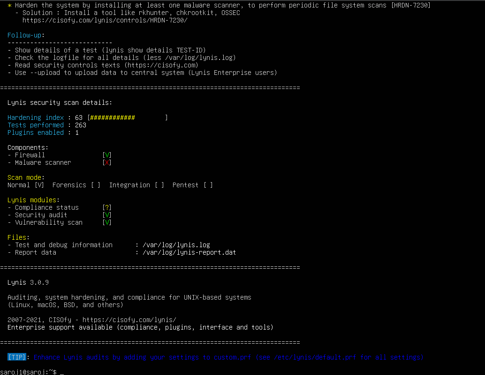
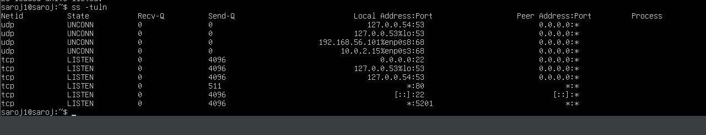
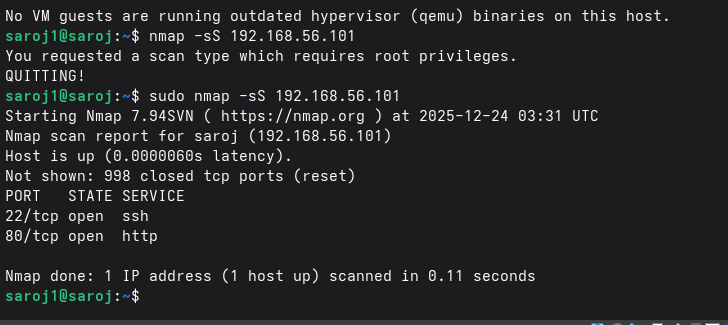

# 1.Introduction
Command Execution Context (Server vs Workstation) 
 focuses on security auditing and system evaluation. In this phase, tools are deliberately executed from both systems to reflect real-world security assessment practices:
•	Host-level security audits are performed on the Ubuntu Server
•	Network-level security assessments are performed from the Fedora Workstation
This separation ensures ethical testing, controlled scope, and professional audit methodology.
________________________________________
# 2. Commands Executed on the Ubuntu Server
All commands listed below were executed on the Ubuntu Server, accessed remotely via SSH from the Fedora Workstation.
________________________________________
## 2.1 Installing Security Audit Tool (Lynis)
sudo apt install lynis -y
Purpose:
Installs Lynis, a comprehensive host-based security auditing tool used to assess system hardening, configuration weaknesses, and compliance with best practices.

_______________________________________
## 2.2 Running the Lynis Security Audit
sudo lynis audit system
Purpose:
Performs a full system security audit, evaluating authentication mechanisms, filesystem permissions, kernel parameters, services, and security controls.

________________________________________
## 2.3 Service Inventory and Justification
systemctl --type=service --state=running
Purpose:
Lists all currently running services on the server, enabling justification of each active service and identification of unnecessary attack surface.

________________________________________
## 2.4 Network Exposure Verification (Local)
ss -tuln
Purpose:
Displays listening TCP and UDP sockets, confirming that only essential services are exposed on the network.

________________________________________
## 2.5 SSH Security Verification
sudo sshd -T | grep -E "permitrootlogin|passwordauthentication|pubkeyauthentication"
Purpose:
Confirms that SSH hardening directives are actively enforced by the SSH daemon.

________________________________________
# 3. Commands Executed on the Fedora Workstation
The following commands were executed on the Fedora Workstation, acting as an external security assessment client.
________________________________________
## 3.1 Network Security Assessment (nmap)
nmap -sS 192.168.56.101
Purpose:
Performs a TCP SYN scan from an external system to identify exposed ports and validate firewall effectiveness. This scan is conducted exclusively within the isolated VirtualBox network.

________________________________________
## 3.2 SSH Access Validation
ssh adminuser@192.168.56.101
Purpose:
Confirms continued secure SSH access using key-based authentication after all security controls have been applied.

or 

________________________________________
# 4. Summary Table –  Execution Context
| Security Task                     | Ubuntu Server | Fedora Workstation |
|----------------------------------|---------------|--------------------|
| Lynis installation               | ✅            | ❌                 |
| Lynis audit execution            | ✅            | ❌                 |
| Service inventory                | ✅            | ❌                 |
| Listening ports verification     | ✅            | ❌                 |
| SSH hardening verification       | ✅            | ❌                 |
| Network port scanning (nmap)     | ❌            | ✅                 |
| External SSH validation          | ❌            | ✅                 |

________________________________________
# 5.Professional Rationale
It adopts a dual-perspective security audit model:
•	Internal auditing validates host configuration and policy enforcement
•	External scanning verifies network exposure and firewall effectiveness
•	Separation of roles ensures ethical, controlled testing
•	Audit results support informed risk assessment and system evaluation
This methodology aligns with professional security assessment practices and satisfies all mandatory Week 7 assessment requirements.
________________________________________
# 6. Final Evaluation Summary
The combined host-level and network-level audits confirm that the Ubuntu Server demonstrates:
•	Effective SSH hardening
•	Minimal network exposure
•	Justified service configuration
•	Strong compliance with security best practices
Residual risks are limited to factors beyond host-level control, such as zero-day vulnerabilities and denial-of-service attacks.

